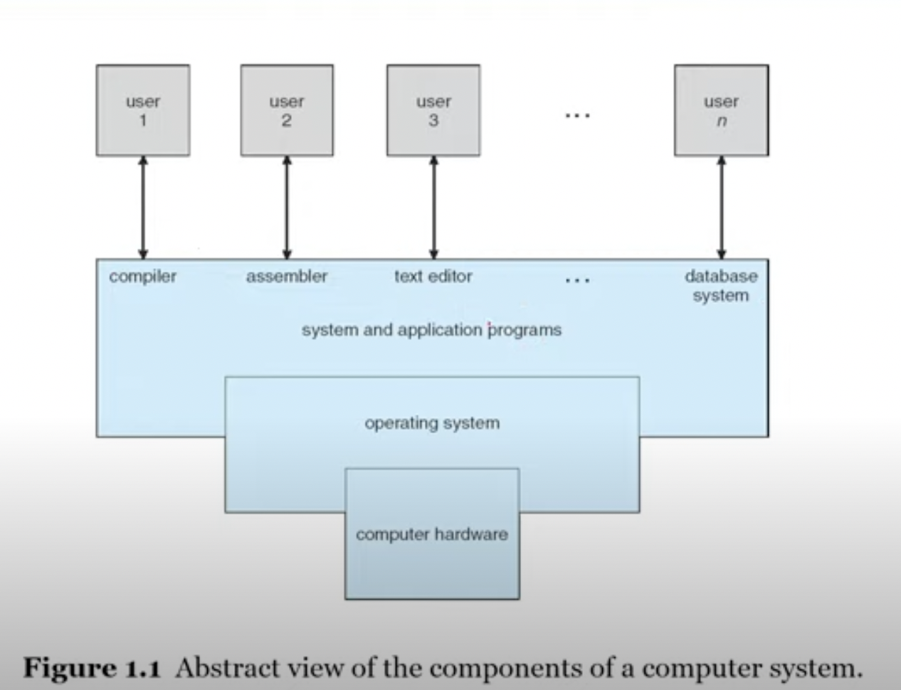
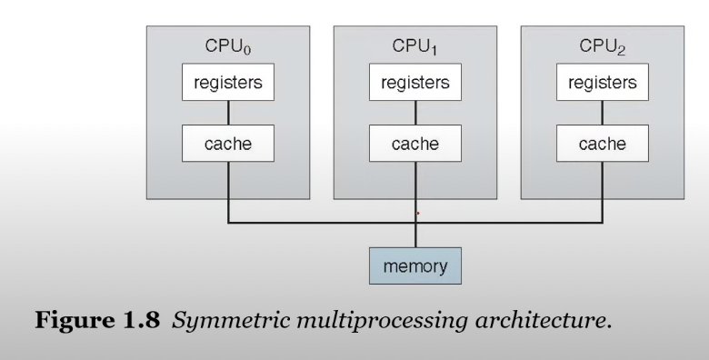
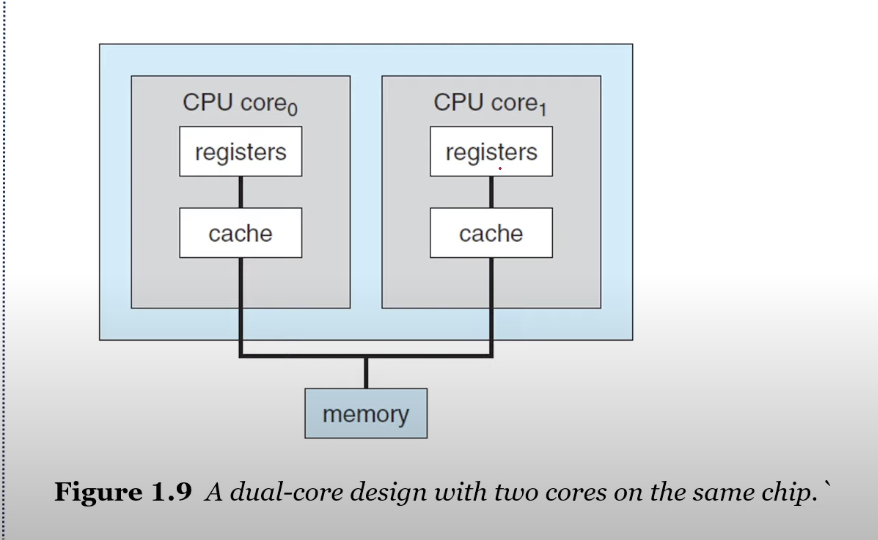

# Chapter 1-2

## index

- 1.1 What Operating Systems Do
- 1.2 Computer-System Organization

## 1.1 What Operating Systems Do

- An operating system is
  - a software that manages a computer`s hardware
- It also provides a basis for application programs and
  - acts as an **intermediary** between
  - the computer user and the computer hardware

### Defining Operating Systems

- There are NO universally accepted definition of an operating system.
- A more common definition is that
  - _"the one program running at all times on the computer"_
  - usually called the **kernel**
- Along with the kernel, there are two other types of programs:
  - system programs
  - application programs

## 1.2 Computer-System Organization

- A bootstrap program is
  - the first program to run on computer power-on

### Interrupts

- Hardware may trigger an interrupt at any time
  - by sending a signal to the CPU, usually by way of the system bus

### von Neumann architecture

- A typical instruction-execution cycle
  - first **fetches** an instuction from memory
  - and stores that instatuction in the **instruction register**
- The instuction is then decoded
  - and may cause operands to be fetched from memory
  - and stored in some internal register

### Storage

The wide variety of storage systems can be organized in a hierarchy according to:

- storage capacity
- and access time

### I/O Stucture

A lage portion of OS code is dediacted to managing I/O

## 1.3 Computer System Architecture

### Definintion of Computer System Components

- CPU: The hardware that executes instructions
- Processor: A physical chip that contains one or more CPUs
- Core: The back computation unit of the CPU
- Multicore: Including multiole computing cores on the same CPU
- Multiprocessor: Including multiple processors

1. Symmetric multiprocessing (SMP)

> CPU 가 여러개

The most common multiprocessor systems

- in which each peer CPU processor performs all tasks

2. Multi-core design

> CPU 한 개에 코어가 여러개

with sevral cores on the **same processor chip**

## 1.4 Operating System Operations

### Multiprogramming

program: A set of instructions

여러개의 프로그램을 하나의 메모리에 동시에 올리는 것

- runs more than one program at a time
- keeps several process in memory simultaneously
  - to increase CPU utilization (CPU 타임 효율)

### Multitasking (=multiprocessing)

하나의 CPU로 여러개의 job을 수행하는 것

> concurrency vs pallelism

- a logical extension of multiprogramming
  - in which CPU switches jobs so frequently that
  - users can interact with each jobs while it is running
- CPU scheduling:
  - If several processes are ready to run at the same time,
  - the system must choose whice process will run **next**

### Operation mode

Two Separate mode of operations:

- user mode and kernel mode
- to ensure that an incorerct program
  - cannot cause other programs to execute incorrectly

## 1.7 Virtualization

Virtualization is:

- a technology that allow us
  - to abstact the hardware of a single computer
  - into sevral diffrent execution environment

## 1.10 Computing Environments

Operating Systems in the Variety of Computing Environments

- Traditional Computing
- Mobile Computing
- Client-Server Computing
- Peer-to-Peer Computing
- Cloud Computing
- Real-Time Embedded Systems

## 2.1 Operating System Services

OS provides an environment for the execution of programs

- User interface
- **Program execution**
- I/O operation
- File-system manipulation
- Communications
- Error detection
- Resource allocation
- Logging
- Protection and security

## 2.2 User and Operating-System Interface

Three fundamental ways for **users** to interface withe the OS:

- CLI: command line interface, or command interpreter
- GUI: graphical user interface
- Touch-Screen Interface

## 2.3 System Calls

> provide an interface to the services made avaliable by the OS  
> OS의 API
