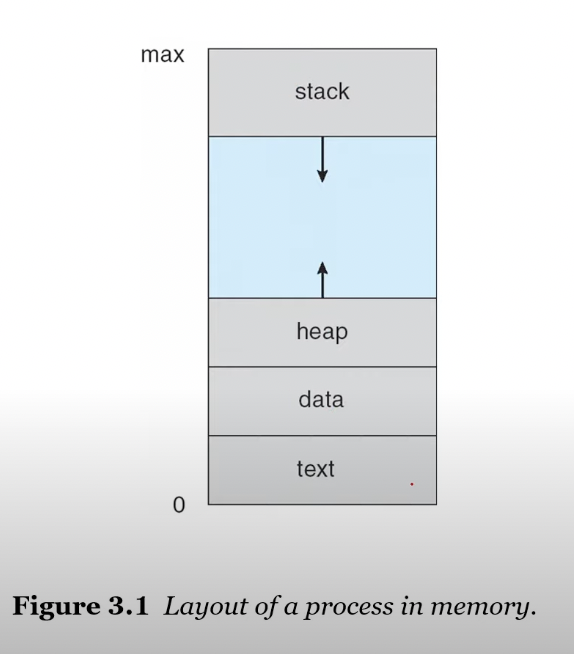
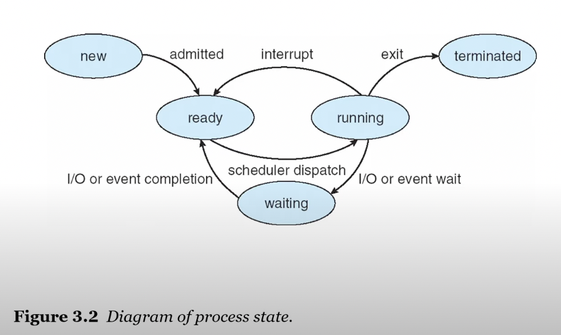
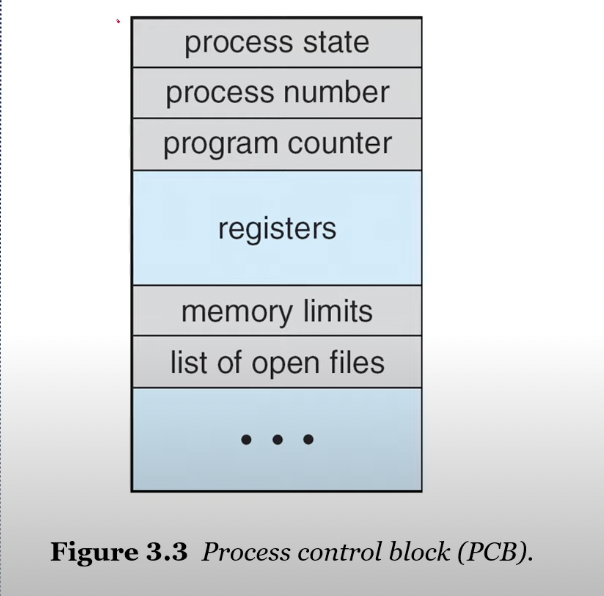
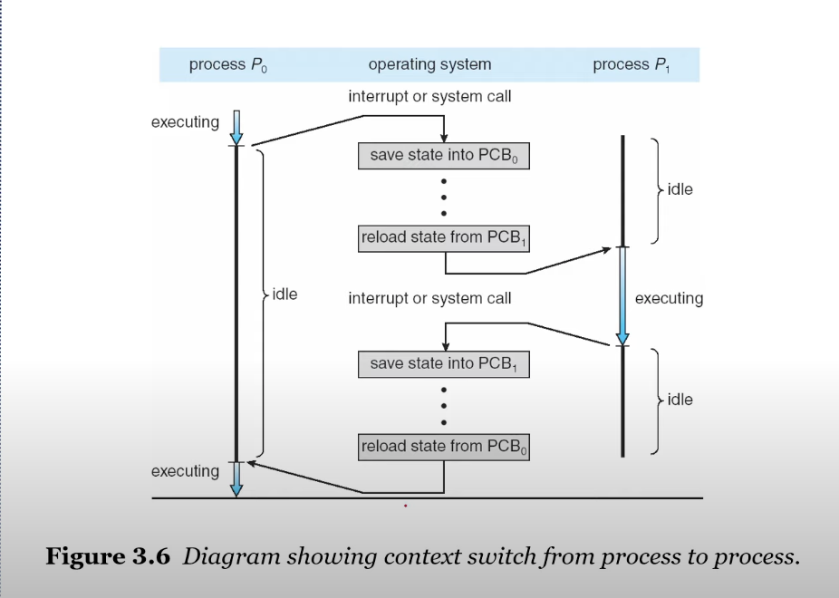
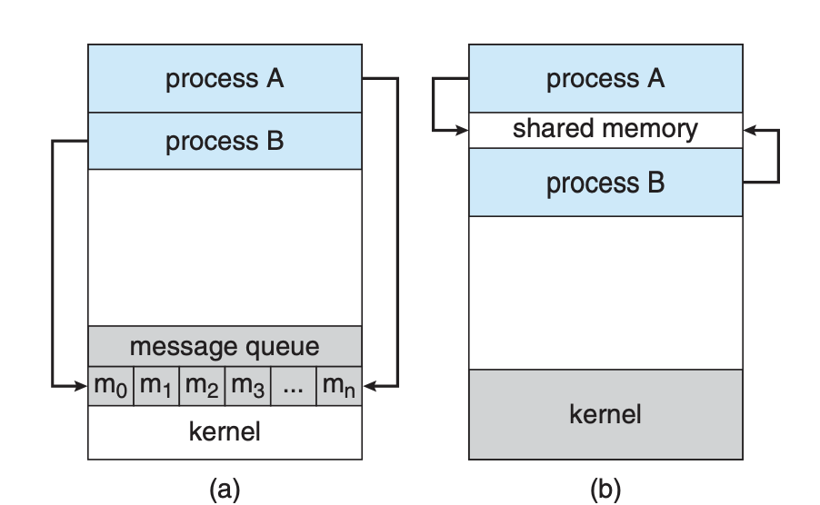

#

## index

## 3.1 Process Concept

A procces is a program in execution

> 실행 중인 프로그램을 프로세서라고 한다.

OS 입장에서는 작업의 단위가 프로세스 단위

하나의 프로세스가 실행되기 위해서는

- CPU time
- memory (메모리에 올라와야 하고)
- files
- and I/O devices

와 같은 resource 가 필요하다.

--> os는 프로세스를 관리해야 한다.

### The memory layout of a process is divided into multiple sections:

- Text section
  - the executable code
- Data section
  - global variables
- Heap section
  - **memory** that is dynamically **allocated** during program run time
- Stack section
  - temporary data storage when invoking functions
  - such as function parameters, return address, and local variables



### Process Lifecycle

- As a process executes, it chages its state.

  - New: the process is being created
  - Running: Instructions are being executed
  - Waiting: the process is waiting for some event to occur
    - such as an I/O completion or reception of a signal
  - Ready: the process is waiting to be assigned to a processor
  - Terminated: the process has finished execution



```txt
new -> ready -> running ->(interrupt) ready -> running(by scheduler dispatch)
                        -> waiting
                        ->(exit) terminated
```

### PCB, TCB

- PCB(Process Control Block) or TCB(Task Control Block)
  - Each process is represented in the operating system by the PCB
- A PCB contains many pieces of _information_ associated with a specific process

  - Process state
  - Program counter(PC)
  - CPU registers
  - CPU-scheduling information
  - Memory-management information
  - Accounting information
  - I/O status information



A process is

- a program that performs a _*single thread of execution*_
- The single thread of control allows the process to perform
  - the only one task at a time
- Modern operating systems have extended the process concept
  - to allow a process to have **muliple threads of execution**
  - and thus to perform more than one task at a time

프로그램 안에서도 여러개를 쪼개서 실행시키면 되지 않을까?

A **thread** is a lightweight process

## 3.2 Process Scheduling

- The objectivve of multiprogramming is
  - to have some process running at all times (동시에) <-> parallel
  - so as to maximize CPU utilization
- The objective orf **time sharing** is
  - to switch a CPU core among process so frequently
  - that users can interact with each program while is running

### Scheduling Queues

As processes enter the system, they are put into a _ready queue,_

- where they are ready and waiting to execute on a CPU`s core

Processes that are waiting for a certain event to occur

- are placed in a _wait queue._

### Context Switch (문맥 교환)

- The _context_ of a process is represented in the PCB
- When an interrupt occurs
  - the system **saves** the **current context** of the running process,
  - so that, later, it can **restore** that context when it should be **resumed**
- The context switch is a task that
  - switches the CPU core to another process
  - performs a state **save** of the current process
  - and a state **resore** of a diffrent process



## 3.3 Operating on Processes

OS는

- 새로운 프로세스를 생성하고
- 프로세스를 종료할 수 있어야 한다.

프로세스는 몇가지 새로운 프로세스를 만들기도 한다.

- the creating process: a _parent_ process
- a newly created process: a _child_ process

After a `fork()` system call,

- the parent can **continue its execution**; or
- if it has nothing else to do while the child runs,
  - it can issue a `wait()` system call
  - to move itself off the ready queue until the termination of the child

## 3.4 Interprocess Communication

동시에 실행되는 프로세스는

- 독립적인 프로세스
- 협력적인 프로세스로 나뉜다.

독립적인 프로세스는 share data 가 없다.

A process is **cooperating**

- if it can affect or be affected by the other processes
- Cleary, any processes that **shares data** with other processes is a cooperating process

프로세스간 통신 문제: IPC(Inter-Process Communication)

Two fundamental models of IPC:

- shared memory (공유 메모리)
- message passing



## 3.5 IPC in Shared-Memory Systems

Producer-Consumer Problem:

- 생산자는 정보를 생산하고, 소비자는 정보를 소비하는 모델
- 예를 들면 웹서버는 html 을 생산하고, 브라우저는 이를 소비하는 모델

### shared-memory

- To allow producer and comsumer to run _concurrently_
- Let a **buffer** of items be avaliable,
  - a producer can _fill the buffer_, and
  - a comsumer can _empty the buffer_

A **shared memory** is a region of memory

- that is shared by the producer and comsumer processes

## 3.6 IPC in Message-Passing Systems

- Shared-Memory
  단점: 응용프로그램을 작성한 사람이 직접 공유 메모리를 관리하는 코드를 작성을 다 해주어야 한다.

- Message-Passing
  O/S provides the means for cooperating processes

  - to communicate with each other via a message-passing facility

Two Operations

- send(message)
- receive(message)

### Direct

명시적으로 이름을 정해서 전달하는 방식

- send(P, message) P 프로세스에게 메세지를 보내는
- receive(Q, message) Q 프로세스로 부터 메세지를 받는

속성

- Link가 자동으로 생성이 된다.
- one to one link 하나만 생성이 된다.

### Indirect

the messages are sent to and received from **mailboxes or ports**

- send(A, message)
- receive(A, message)

속성

- Link는 공유된 mailbox가 있어야만 생성이 된다.
- 두 개 이상의 프로세스와 통신이 가능하다.

### Diffent desing option for implementation

blocking and non-blocking

- Blocking send: the sender is blocked until the message is received
- Non-blocking send: the sender is sends the message and _continue_
- Blocking receive: the receiver blocks until a message is available
- Non-blocking receive: the receiver retrieves either a valid message or a null message

Blocking -> synchronous (동기)
Non-blocking -> asynchronous (비동기)
