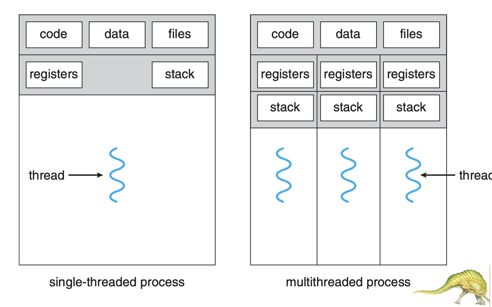

# Thread

## index

- Overview
- Multicore Programming
- Multithreading Models
- Thread Libraries
- Implicit Threading
- Threading Issues
- Operating System Examples

## 4.1 Overview

So far, we assumed that

- a process was an executing program _with a single thread of control_
- however, a process is able to contain multiple threads of control

A thread is

- a lightweight process
- a basic unit of CPU utilization
- comprises a _thread ID_, a _program counter_, a _register set_, and a _stack_

### 장점

1. non-blocking 하게 처리할 수 있다.
2. 리소스 공유차원
3. 경제성
4. 확장성

## 4.2 Multicore Programming

문제: (프로그래머의 할 일)

- Identifying tasks: find aareas can be divided into seperate tasks
- Balance
- Data splitting
- Data dependency
- Testing and debugging

### Amdalhl`s Law

- 코어는 무조건 많을수록 좋은가? -> 아니다.

## 4.3 Multithreading Models

- two types of threads
  - **user** threads and **kernel** threads
- User threads are
  - supported above the kernel, and
  - are managed without kernel supprot
- Kernel threads are
  - supported and managed directly by the os

Three relationships between user and kenel threads

1. manay-to-one model
2. one-to-one model
3. many-to-many model

## 4.5 Implicit Threading

The Strategy of Implicit Threading

- Thread Pools
  - create a number of threads in a pool where they await work
- Fork & Join
  - explicit threading, but an excellent candidate for implicit threading
- OpenMP -> 컴파일러에게 지시
- Grand Central Dispatch (GCD)
